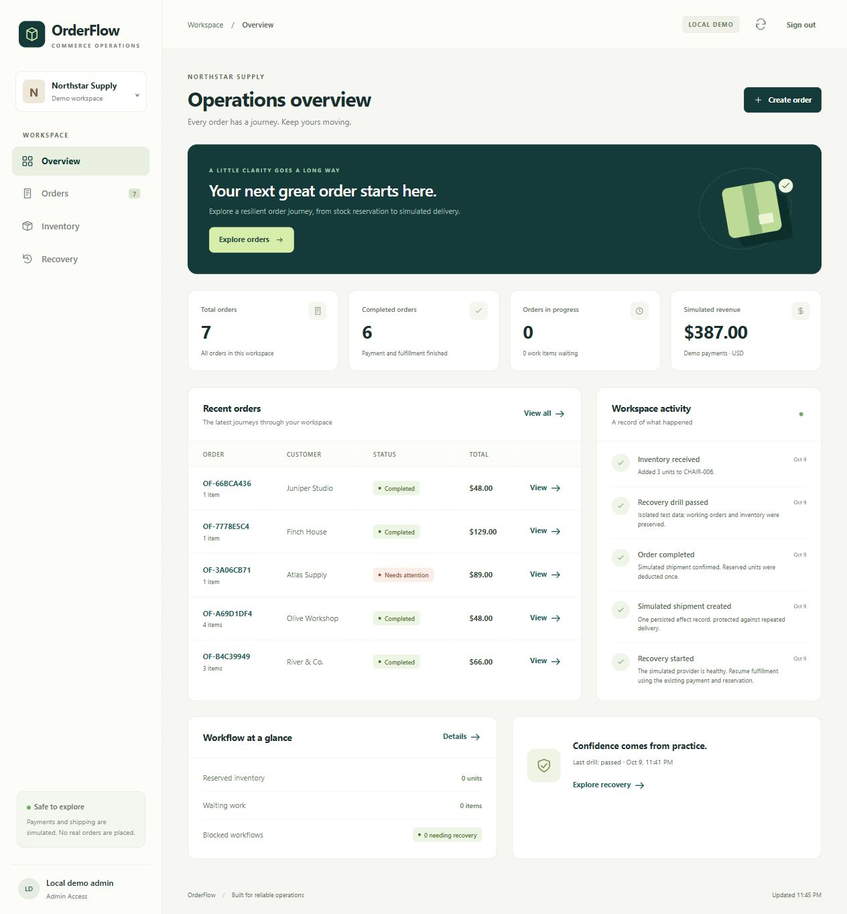
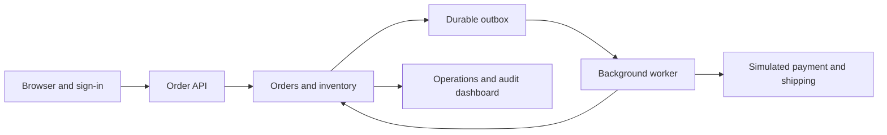

# OrderFlow

An order-processing and recovery application built to demonstrate inventory consistency, reliable background work and visible failure recovery. Its local application runs with Python's standard library; its AWS implementation uses serverless services in **ap-southeast-2 (Sydney)**.

Create an order, reserve inventory, follow payment and fulfillment, and recover interrupted work from the operations dashboard. The catalog is synthetic. **Payments, refunds and shipping are simulations**: no money moves, no real customer data is required and no parcel is dispatched.

**Deployment status:** a temporary Sydney deployment passed live API, infrastructure and hosted browser checks on **10 October 2026**, then was backed up and removed as requested. There is **no active hosted OrderFlow application**. The local app remains available. See [verification evidence](docs/verification.md) for what passed and what remains unverified. The repository remains named `aws-retail-forecasting-platform` until its owner chooses to rename it.



## Run locally

Use Python 3.11 or newer, from this repository:

```powershell
git clone https://github.com/leon2378/aws-retail-forecasting-platform.git
cd aws-retail-forecasting-platform
python -m orderflow serve --port 8000
```

Open [http://127.0.0.1:8000](http://127.0.0.1:8000). The SQLite database lives at `data/orderflow.db`, outside source control. Stop the server with Ctrl+C. The frontend requires no package installation, external fonts or build service.

A fresh workspace includes six sample orders covering success, payment decline, transient fulfillment failure and failed-work recovery. Existing orders are preserved. For a fresh catalog with no sample orders, use `python -m orderflow serve --database data/empty-orderflow.db --empty`.

The sign-in screen is a **local role demonstration**, not authentication of real people. Viewer can inspect the application, Operator can submit orders, process work and recover failed fulfillment, and Admin can also adjust inventory and run the isolated drill. Permissions are checked by the server. Production identity is a separate Cognito boundary described in [authentication](docs/authentication.md).

## What to demonstrate

1. Create an order and process its background work. Inspect its inventory reservation and payment/fulfillment audit events.
2. Submit the same request with the same idempotency key. It returns the existing order; changed content with that key is rejected.
3. Place concurrent orders for the final unit. Exactly one reservation succeeds.
4. Select the simulated payment-decline scenario. The order records a failed payment and its reservation is released.
5. Simulate an interruption after an external effect. Recovery uses the durable effect record so it does not repeat the payment or shipment.
6. Exhaust retries for a simulated fulfillment failure, then recover the failed work. The existing payment remains one payment.

The isolated recovery drill records machine-readable evidence. It exercises its own temporary database so it does not change the application's orders or inventory. See [operations](docs/operations.md).

## Reliability boundaries

- An order and its stock reservation commit in one transaction. Inventory never goes below zero.
- Idempotency keys are scoped to their submitting identity and compared with the normalized request content.
- An order transition and its outgoing work record commit together in a durable outbox.
- Simulated external effects have stable identifiers and stored outcomes. A retry reuses that outcome.
- Failed work has bounded attempts, visible dead-letter status and an explicit recovery action.
- Audit events retain the order's progress and recovery history.

These are implementation properties with automated checks. They do not establish the behavior of a real payment processor or shipping service. Real integrations must support their own idempotency and reconciliation, including the uncertainty between an external success and a local crash. This application does not claim exactly-once network delivery.

## Architecture



Locally, the API and worker use SQLite. The AWS implementation uses API Gateway and Lambda for requests, Cognito for identity, DynamoDB for state, SQS for work and dead letters, and S3 with CloudFront for the website. Deployment and operational limits are documented in [AWS setup](docs/aws.md). The local implementation is a reference for the same behavior, not an emulator of AWS service guarantees.

## Verify and operate

The local application needs no third-party Python packages. The full verification suite also checks AWS adapters and requires the optional AWS SDK:

```powershell
python -m pip install -e ".[aws]"
python -m unittest discover -s tests -v
node --check frontend/app.js
node --check frontend/auth.js
node --test tests/frontend_auth.test.mjs tests/frontend_workflows.test.mjs
```

Local administration commands are available without AWS credentials:

```powershell
python -m orderflow seed --database data/orderflow.db
python -m orderflow demo --database data/orderflow.db
python -m orderflow process --database data/orderflow.db --limit 20
python -m orderflow drill --database data/orderflow.db
python -m orderflow backup data/backups/orderflow.db --database data/orderflow.db
python -m orderflow validate --database data/orderflow.db
```

`seed` initializes a catalog without replacing records; `demo` adds the six samples only to an empty workspace. `process` advances at most one stage of each selected pending order, so a successful order needs payment and fulfillment passes. Choose a new backup filename for every backup. See the operations guide before restoring.

The suite checks inventory races, duplicate handling, retry behavior, authorization and HTTP security. These repository tests operate locally and do not create cloud resources. Separate live verification passed **34 API/workflow checks, 15 infrastructure checks and 13 browser checks**, including three Cognito roles, automatic fulfillment, a stock race, duplicate delivery, cancellation and recovery. The deployed Standard Step Functions drill passed nine isolated checks. These are small functional checks, not production load or real commerce tests.

This is a bounded demonstration workspace: local storage allows at most 250 orders and the AWS adapter at most 100. Both retain the most recent 1,000 workspace audit events, 20 drill reports and 60 timeline entries per order. AWS admission also reserves storage for unfinished work and recovery, so size limits can reject new orders before the 100-order cap. Duplicate requests and existing order processing are allowed at the order cap. It is not a permanent audit archive or a multi-tenant commerce service. See [AWS storage limits](docs/aws.md) before considering larger workloads.

The optional Docker image runs the isolated recovery drill as a non-root user and exits:

```powershell
docker build -t orderflow-drill .
docker run --rm orderflow-drill
```

The image exposes no website port. Use the local `serve` command above for the application.

- [API contract](docs/api.md)
- [Sign-in and permissions](docs/authentication.md)
- [Recovery, backup and shutdown](docs/operations.md)
- [AWS deployment](docs/aws.md)
- [Costs and alerts](docs/costs-and-alerts.md)
- [Verified behavior and remaining checks](docs/verification.md)
- [Two-minute local demo walkthrough](docs/demo.md)

Production readiness still requires a DynamoDB replacement-table restore, sustained concurrency/load testing, natural queue redelivery and physical dead-letter arrival, publisher-failure recovery, confirmed operational alert inbox receipt, and tested third-party commerce integrations. The successful hosted drill exercised isolated simulation state; it did not restore the AWS database. Budget alerts are spending warnings, not a hard cap.

Maintained by **Leon Lusbo** ([leon2378](https://github.com/leon2378)).
