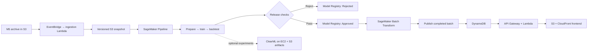

# Shelfcast

A retail demand forecasting and replenishment application, with a local development mode and an AWS deployment foundation in **ap-southeast-2 (Sydney)**.

Select a store and product, replay a historical date, inspect the next 28 days of expected sales and approximate uncertainty, and compare inventory policies against held-out historical sales. The model lab compares a seasonal baseline with XGBoost using chronological backtests and demonstrates a rejected release followed by an approved one.

**Data status:** the repository includes a deterministic synthetic generator, not M5 observations. The interface labels it clearly. Import the M5 competition CSVs to use genuine historical sales. Synthetic product names are invented; real M5 items keep their anonymous identifiers.

**Deployment status:** AWS resources are defined in Terraform and pipeline code. No cloud resources have been provisioned or live AWS execution verified. Local execution does not need AWS credentials.


## Run locally

Python 3.11 or newer is required. The seasonal baseline and local application use the standard library only:

```powershell
python -m retail_forecast serve --port 8000
```

Open [http://127.0.0.1:8000](http://127.0.0.1:8000). Stop the server with Ctrl+C.

To enable real XGBoost training and the AWS tooling:

```powershell
python -m venv .venv
./.venv/Scripts/python.exe -m pip install -e ".[ml,aws]"
./.venv/Scripts/python.exe -m retail_forecast serve --port 8000
```

On macOS/Linux use `.venv/bin/python` instead. The frontend has no npm build, external scripts, CDN fonts, or runtime third-party web dependency. Run from this repository; its `frontend/` directory is served alongside the API. For an installed editable package, the `shelfcast` command also works.

## Import M5

For automatic download and import, install the optional official Kaggle client and sign in once:

```powershell
./.venv/Scripts/python.exe -m pip install -e '.[data]'
./.venv/Scripts/kaggle.exe auth login
./.venv/Scripts/python.exe -m retail_forecast download-m5 --import
```

Complete the browser sign-in prompts; the client saves your authorization locally. If Kaggle asks you to join the competition or accept its rules, do that on the [M5 competition page](https://www.kaggle.com/competitions/m5-forecasting-accuracy) before downloading. The command downloads only the three required CSVs into `data/m5`, safely extracts compressed responses, validates the data and imports 12 products per store from CA_1, TX_1 and WI_1. Use `--stores` and `--max-items` to change that subset. Existing valid files are reused; `--force` downloads replacements.

The official client also supports an API token in `~/.kaggle/access_token`, or legacy credentials in `~/.kaggle/kaggle.json`. Configure credentials locally, outside this repository. Downloaded data and credential filenames are ignored by Git. See [Kaggle's authentication documentation](https://github.com/Kaggle/kaggle-cli/blob/main/docs/README.md#authentication).

Restart the local server after import to replace the synthetic demonstration with M5 sales.

For a manual download:

Obtain the data through the official [M5 Forecasting – Accuracy dataset page](https://www.kaggle.com/competitions/m5-forecasting-accuracy/data), following its competition terms. Extract these files into a local folder:

- `sales_train_evaluation.csv` (preferred), or `sales_train_validation.csv`
- `calendar.csv`
- `sell_prices.csv`

```powershell
./.venv/Scripts/python.exe -m retail_forecast import-m5 "C:/path/to/m5" --stores CA_1 TX_1 WI_1 --max-items 12
./.venv/Scripts/python.exe -m retail_forecast serve --port 8000
```

Restart an already-running server after importing. The importer writes `data/dataset.json`, validates day continuity, numeric sales, selected identities and price records, and records source SHA-256 hashes. It streams CSVs and defaults to 12 items **per store** to keep iteration practical. Selection follows file order, so this is not a representative sample of every category. Raise `--max-items` deliberately; the initial ML workflow fits each series independently and is not optimized for the entire M5 hierarchy.

Real M5 data uses item IDs, not the demo's invented descriptions. Sell prices are retained as descriptive metadata; the current forecasts do **not** use future prices or event information. Keep raw data outside source control; `data/` is ignored.

## What the application does

- **Demand forecast:** the chart displays 28 recent observed days and a 28-day forward forecast, with a seasonal comparator and approximate uncertainty band. The API retains 84 observed days for inspection.
- **Historical replay:** an explicit count of observed days; advancing the replay date reveals one additional day to the model. Historical dates refer to the dataset, not today's calendar.
- **Model comparison:** a four-week same-weekday mean versus a fitted XGBoost Poisson model with lag, rolling-statistic and calendar features.
- **Inventory simulation:** fixed-quantity ordering, forecast order-up-to, and a buffered policy, with configurable initial stock, lead time, review period and cost assumptions.
- **Release demonstration:** a deliberately degraded candidate fails a measured baseline gate; a baseline clone passes a parity gate. It writes a local audit log and does not change the application model or claim improvement.

## Evaluation and interpretation

Every model origin uses only preceding observations. For each selected replay date, two earlier 28-day windows calibrate residual bands; three later disjoint 28-day windows score forecast error and coverage. The final model fits through the replay cutoff. XGBoost recursively uses its own earlier predictions for unavailable future lags. Hyperparameters are fixed rather than tuned on the displayed test windows.

WAPE is pooled absolute error divided by total observed sales over the three scored windows. MAE is mean absolute error in units. Bias is signed prediction error divided by observed sales; positive values mean overprediction. WAPE and bias display as unavailable for zero-demand windows. These are per-series metrics, **not the competition's official hierarchical WRMSSE**.

The chart's central forecast is expected sales (the API retains the `p50` field name for its common response schema). Lower and upper bands use empirical 10th/90th-percentile signed residuals and are constrained to contain the point forecast. They are approximate intervals, not guaranteed conditional quantiles; coverage is measured on later windows and may differ from 80%.

Inventory uses historical observed sales as a demand proxy. It accounts for on-order stock, receives zero-lead-time orders before sales, and treats shortages as lost sales. Comparative cost includes end-of-day holding cost, lost-sales penalties and order fees. Procurement spend is reported separately, so changing unit cost does not change comparative cost. Forecasts repeat beyond day 28 when a policy needs a longer planning horizon; remaining stock and pipeline orders are reported without terminal salvage value.

All savings are **simulation results**, not realized business savings. The best simulated policy is selected after scoring. Real demand may exceed recorded sales when shelves were empty; this dataset cannot establish that missing demand. There is no capacity, expiry, minimum order quantity or random lead-time model yet.

## CLI and tests

```powershell
./.venv/Scripts/python.exe -m retail_forecast forecast --store CA_1 --item HOBBIES_1_001 --model xgboost
./.venv/Scripts/python.exe -m retail_forecast release-demo
./.venv/Scripts/python.exe -m unittest discover -s tests -v
```

Forecast exports exclude held-out future actuals. Tests cover leakage boundaries, chronological splits, dataset validation, stock flows, edge cases, API input validation and publication safeguards. Optional XGBoost tests skip when that dependency is absent; use the ML extra to run them.

## AWS architecture



Terraform defines storage, delivery, IAM roles, compute configuration, logging, and the optional experiment server. SageMaker executes training and batch inference; the API reads materialized results instead of training on a request. The replay cursor advances only after a complete successful publication. Schedules are disabled by default.

Follow [docs/aws.md](docs/aws.md) for packaging, configuration, deployment order, CI/CD, ClearML and operational limitations. Read and review a Terraform plan before creating billable AWS resources. The local synthetic dataset is suitable for smoke testing infrastructure, not for reporting M5 performance.

Confirm the regional quotas and provisioning-role permissions in the deployment runbook before deploying. See [the API reference](docs/api.md) for response schemas and publication safeguards.

## Project map

| Path | Purpose |
|---|---|
| `frontend/` | Responsive application, SVG charts and API client |
| `retail_forecast/data.py` | Synthetic generator and M5 importer |
| `retail_forecast/forecast.py` | Training, portable model artifacts, inference and backtests |
| `retail_forecast/inventory.py` | Replenishment simulation |
| `retail_forecast/api.py`, `storage.py` | Shared API contract and local/DynamoDB repositories |
| `aws/` | Lambda handlers, SageMaker pipeline and job/image entry points |
| `infra/` | Terraform infrastructure |
| `tests/` | Automated behavior and integration checks |

## Next production milestones

Import genuine M5 data and establish a baseline on a documented product subset; then validate one AWS replay end to end. Before broader use, add authentication for non-public data, representative global modeling and hierarchy-aware evaluation, cost/load testing, drift monitoring, and tests on actual operational inventory data. All deployed application infrastructure can stay in AWS; local development is intentionally independent.

References: [SageMaker Pipelines](https://docs.aws.amazon.com/sagemaker/latest/dg/pipelines.html), [batch inference](https://docs.aws.amazon.com/sagemaker/latest/dg/batch-transform.html), [model approval](https://docs.aws.amazon.com/sagemaker/latest/dg/model-registry-approve.html), and [M5 data](https://www.kaggle.com/competitions/m5-forecasting-accuracy/data).
